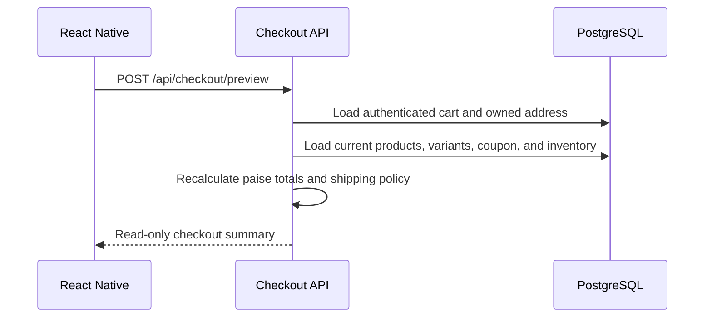
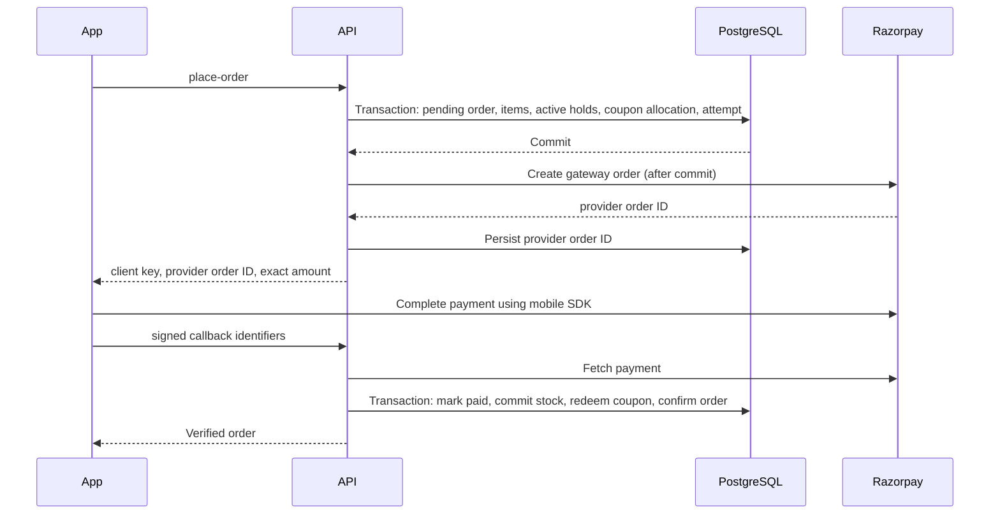

# Commerce Flow

## Boundaries

The React Native app sends only choices and provider callback identifiers. Prices, discounts, stock, ownership, payment state, and order state are server-authoritative. Payload collections provide storage and the Admin views; dedicated services own checkout, inventory, coupon, order, and payment transitions.

Money is stored as integer paise in INR. The current tax policy returns zero with `productionReady: false`; it must be replaced after the business confirms product-specific tax treatment. The local shipping policy is explicitly a development fallback and does not represent carrier-confirmed serviceability.

## Checkout preview



Preview never creates an order, reserves stock, consumes a coupon, or calls Razorpay. Placement repeats all validations.

## COD placement

```mermaid
sequenceDiagram
  participant App
  participant API
  participant DB as PostgreSQL transaction
  App->>API: place-order + customer-scoped idempotency key
  API->>API: Revalidate checkout
  API->>DB: Create confirmed order and immutable items
  API->>DB: Conditional UPDATE inventory reserved
  API->>DB: Create reservation and coupon redemption
  API->>DB: Commit reservation (onHand -= qty, reserved -= qty)
  API->>DB: Create COD payment attempt and audit event
  DB-->>API: Commit atomically
  API-->>App: Confirmed order; payment remains unpaid
```

COD inventory is committed at acceptance, while payment remains `unpaid`. Cancelling an eligible unpaid COD order restocks once and records an inventory movement. COD collection/remittance belongs to fulfillment work in Phase 5.

## Online payment



The verification endpoint requires the authenticated order owner, verifies HMAC over the stored provider order ID and payment ID, fetches the payment from Razorpay, and requires `captured`, matching amount, INR currency, and matching order ID. A mobile success callback alone never marks an order paid.

If gateway order creation has an uncertain network result, the attempt remains pending and its reservation is retained for reconciliation/expiry. This avoids creating a second charge after a timeout. A known missing-configuration error occurs before any order or stock mutation.

## Webhooks and delayed events

Webhook HMAC uses the exact raw body. `(provider, externalEventId)` is unique; when Razorpay does not supply an event ID, a SHA-256 body digest is used. Stored payload metadata is limited to event type, IDs, and status.

Captured events use the same idempotent finalization routine as customer verification. Duplicate success cannot commit stock twice because only `active` reservations can transition to `committed`. Failure events update the attempt but do not immediately release stock; expiry controls release. A captured payment arriving after the hold expired is recorded as paid with `LATE_PAYMENT_REQUIRES_RECONCILIATION`, but the order is not falsely confirmed as fulfillable.

## State transitions

```text
pending_payment --verified payment--> confirmed --> processing --> packed --> shipped --> delivered
       |                                  |            |
       +------------- cancel ------------+------------+

delivered --> returned   (later returns workflow)
cancelled and returned are terminal in Phase 4
```

Payment status is independent: `unpaid | pending | paid | partially_refunded | refunded | failed`. Admins cannot edit either state through generic collection writes. The controlled Admin endpoint never marks an unpaid online order confirmed.

## Reservation and coupon lifecycle

```text
Inventory: active --> committed
                 \-> released
                 \-> expired

Coupon: allocated --> redeemed
                  \-> released
```

Availability is `onHand - reserved`. Reservation uses `UPDATE ... WHERE on_hand - reserved >= quantity RETURNING id` inside the same PostgreSQL transaction as order creation. Variant IDs are processed in stable order to reduce deadlocks. Expiry locks eligible rows with `FOR UPDATE SKIP LOCKED`, making concurrent workers and retries safe.

Coupons are locked during allocation. Allocated and redeemed rows count toward global and per-customer limits, preventing concurrent overuse. Online allocations become redeemed only after verified capture; cancellation or expiry releases them. COD redeems at accepted order creation.

## Recovery operations

- `POST /api/orders/:id/retry-payment` reuses an existing initialized attempt or creates an attempt only while the order and reservation remain eligible.
- `POST /api/admin/inventory-reservations/expire` is an authenticated, retry-safe batch operation for an external scheduler. There was no existing job runner in Phases 1-3, so no Redis or new queue was introduced.
- `POST /api/admin/orders/:id/status` applies the transition matrix and audit history.
- Paid cancellation/refund is deliberately rejected because refunds and returns are later work.
